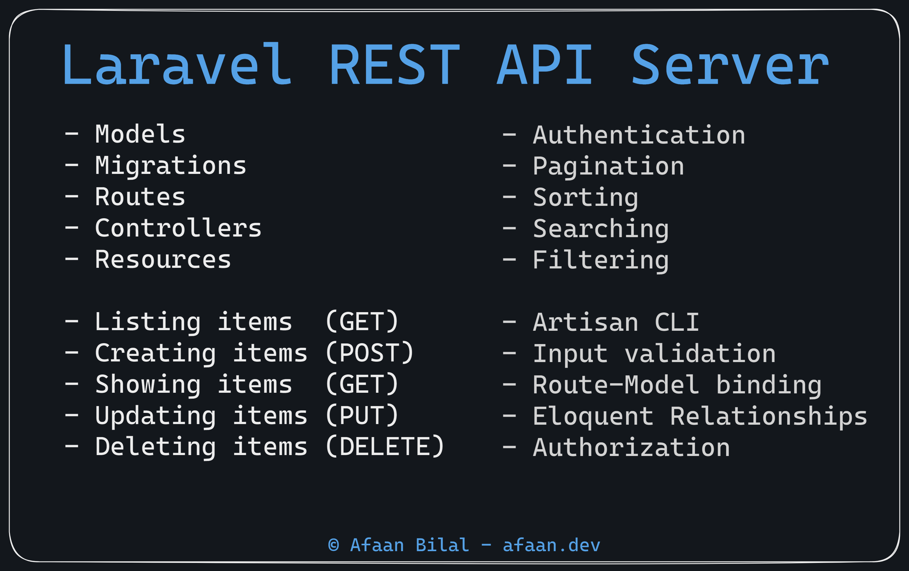
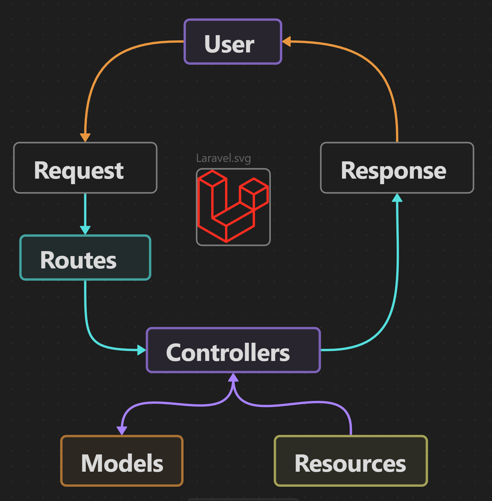
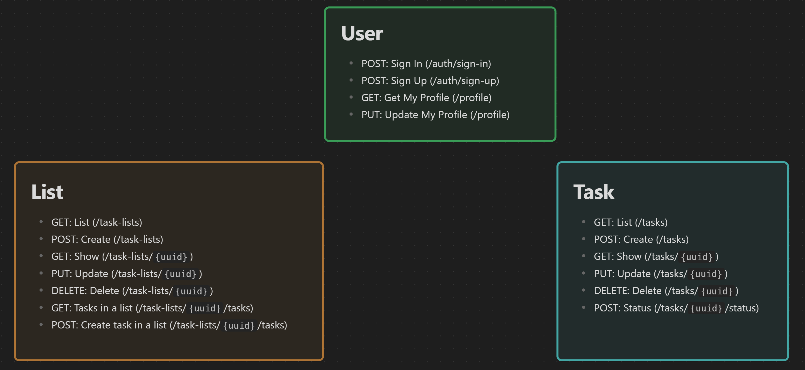
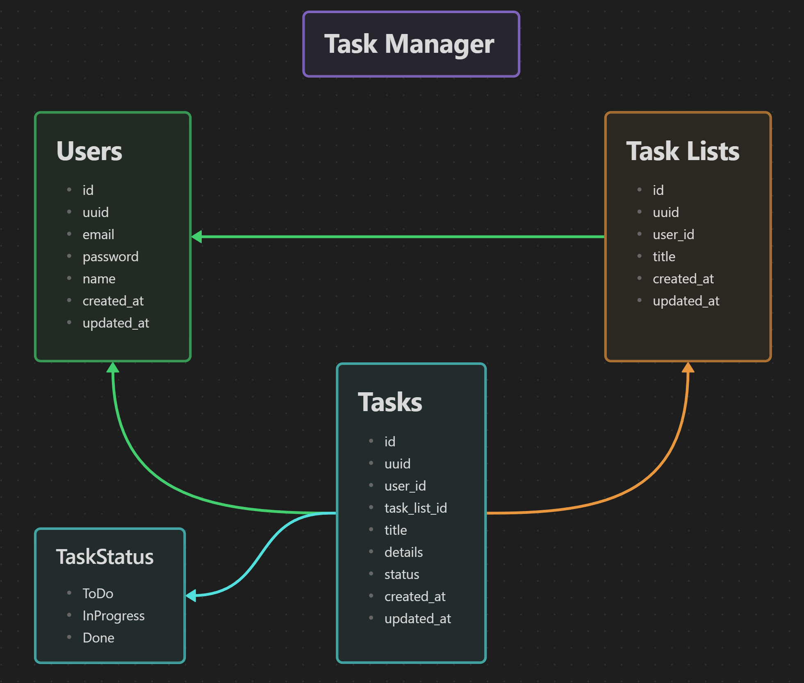

✅ TaskManager
==============

A REST API server built with Laravel.

---

### **Author**: [Afaan Bilal](https://afaan.dev)

---

## Course Overview



---

## Run Development Server
````
php artisan serve
````
---

## Request Flow



## API



### API Base: `/api`

| Method | Path                       | Auth? | Description                                         |
| :----- | :------------------------- | :---- | :-------------------------------------------------- |
| POST   | /auth/sign-up              | ⬜     | Create a new account.                               |
| POST   | /auth/sign-in              | ⬜     | Sign in. Returns an access token on success.        |
| POST   | /auth/sign-out             | ✅     | Sign out.                                           |
| GET    | /profile                   | ✅     | Get the authenticated user's profile.               |
| PUT    | /profile                   | ✅     | Update the authenticated user's profile.            |
| GET    | /task-lists                | ✅     | Get a list of task lists.                           |
| POST   | /task-lists                | ✅     | Create a task list.                                 |
| GET    | /task-lists/`{uuid}`       | ✅     | Get the task list matching the `uuid`.              |
| PUT    | /task-lists/`{uuid}`       | ✅     | Update the task list matching the `uuid`.           |
| DELETE | /task-lists/`{uuid}`       | ✅     | Delete the task list matching the `uuid`.           |
| GET    | /task-lists/`{uuid}`/tasks | ✅     | Get all tasks in the task list matching the `uuid`. |
| POST   | /task-lists/`{uuid}`/tasks | ✅     | Create a task in the task list matching the `uuid`. |
| GET    | /tasks                     | ✅     | Get all tasks.                                      |
| POST   | /tasks                     | ✅     | Create a task.                                      |
| GET    | /tasks/`{uuid}`            | ✅     | Get the task matching the `uuid`.                   |
| PUT    | /tasks/`{uuid}`            | ✅     | Update the task matching the `uuid`.                |
| POST   | /tasks/`{uuid}`/status     | ✅     | Update the task status matching the `uuid`.         |
| DELETE | /tasks/`{uuid}`            | ✅     | Delete the task matching the `uuid`.                |

## Authentication Flow

- **All auth required requests**: Add header `Authorization` with value as `Bearer {access_token}`.

---

## Database Structure



---

## Contributing
All contributions are welcome. Please create an issue first for any feature request
or bug. Then fork the repository, create a branch and make any changes to fix the bug
or add the feature and create a pull request. That's it!
Thanks!

---

## License
**TaskManager** is released under the MIT License.
Check out the full license [here](LICENSE).
